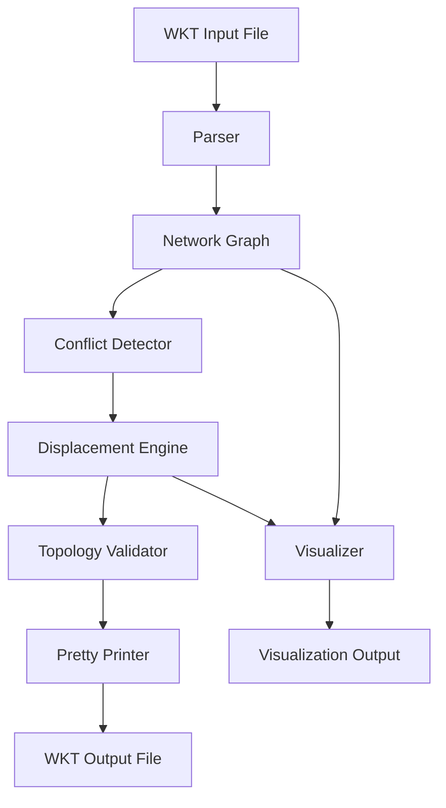

# Design Document: Cartographic Displacement System

## Overview

The cartographic displacement system resolves spatial conflicts in street network data through energy-minimization based displacement. The system parses WKT LINESTRING geometries, detects segments that violate minimum distance constraints, applies displacement transformations while preserving topology, and outputs the adjusted network.

The design uses a **snake-based energy minimization approach** ([adapted from cartographic research](https://www.geog.leeds.ac.uk/groups/geocomp/2000/GC034/Gc034.htm)) where displacement is modeled as minimizing an energy function with internal forces (maintaining line shape) and external forces (resolving conflicts). This approach naturally propagates displacement along connected segments and shares displacement magnitude between interfering lines.

**Technology Stack:**
- Python 3.8+ for implementation
- Shapely 2.0+ for geometry operations (offset_curve, distance calculations)
- NumPy for numerical computations and energy minimization
- Matplotlib for visualization
- SciPy for optimization algorithms

## Architecture



**Component Flow:**
1. **Parser** reads WKT file and creates internal geometry representation
2. **Network Graph** builds topology with segments and intersection points
3. **Conflict Detector** identifies segments violating minimum distance
4. **Displacement Engine** calculates and applies displacement vectors via energy minimization
5. **Topology Validator** verifies connectivity preservation
6. **Pretty Printer** formats output as WKT
7. **Visualizer** generates before/after comparison plots

## Components and Interfaces

### 1. Parser Component

**Responsibility:** Convert WKT LINESTRING format to internal geometry representation

**Interface:**
```python
class WKTParser:
    def parse_file(self, filepath: str) -> List[LineSegment]:
        """Parse WKT file and return list of line segments"""
        
    def parse_linestring(self, wkt_string: str) -> LineSegment:
        """Parse single WKT LINESTRING to LineSegment object"""
```

**Implementation Notes:**
- Use regex to extract LINESTRING geometries from file
- Leverage Shapely's `wkt.loads()` for parsing individual LINESTRING strings
- Convert Shapely LineString to internal LineSegment representation
- Track segment IDs for later reference
- Handle multi-line WKT strings (coordinates spanning multiple lines)

### 2. Network Graph Component

**Responsibility:** Build topological representation of street network

**Interface:**
```python
class NetworkGraph:
    def __init__(self, segments: List[LineSegment]):
        """Build graph from segments"""
        
    def get_intersections(self) -> List[IntersectionPoint]:
        """Return all intersection points where segments meet"""
        
    def get_connected_segments(self, point: IntersectionPoint) -> List[LineSegment]:
        """Return segments connected at given intersection"""
        
    def get_adjacent_segments(self, segment: LineSegment) -> List[LineSegment]:
        """Return segments sharing endpoints with given segment"""
```

**Implementation Notes:**
- Use spatial hash map (dict with rounded coordinates as keys) to find shared endpoints
- Tolerance threshold (e.g., 1e-6) for coordinate matching
- Store adjacency relationships for efficient topology queries
- Build R-tree spatial index using Shapely's STRtree for efficient proximity queries

### 3. Conflict Detector Component

**Responsibility:** Identify segments violating minimum distance constraints

**Interface:**
```python
class ConflictDetector:
    def __init__(self, network: NetworkGraph, min_distance: float):
        """Initialize with network and distance threshold"""
        
    def detect_conflicts(self) -> List[Conflict]:
        """Return all segment pairs violating minimum distance"""
        
    def get_conflict_zones(self) -> List[Polygon]:
        """Return geometric regions containing conflicts"""
```

**Data Model:**
```python
@dataclass
class Conflict:
    segment1: LineSegment
    segment2: LineSegment
    min_distance_point1: Point  # Closest point on segment1
    min_distance_point2: Point  # Closest point on segment2
    actual_distance: float
    required_displacement: float  # min_distance - actual_distance
```

**Implementation Notes:**
- Use R-tree spatial index to find candidate segment pairs within bounding box proximity
- For each candidate pair, compute actual distance using Shapely's `distance()` method
- Exclude adjacent segments (sharing endpoints) from conflict detection
- Store conflict location (closest points) for visualization
- Calculate required displacement magnitude for each conflict

### 4. Displacement Engine Component

**Responsibility:** Calculate and apply displacement transformations using energy minimization

**Interface:**
```python
class DisplacementEngine:
    def __init__(self, network: NetworkGraph, conflicts: List[Conflict], 
                 max_displacement: float, strategy: str = "perpendicular"):
        """Initialize with network, conflicts, and parameters"""
        
    def calculate_displacement(self) -> Dict[int, Vector2D]:
        """Calculate displacement vectors for each segment via energy minimization"""
        
    def apply_displacement(self, displacements: Dict[int, Vector2D]) -> NetworkGraph:
        """Apply calculated displacements and return new network"""
```

**Energy Function:**

The total energy E combines internal energy (shape preservation) and external energy (conflict resolution):

```
E_total = α * E_internal + β * E_external

E_internal = Σ (stiffness * curvature_change²)
E_external = Σ (conflict_penalty if distance < min_distance else 0)
```

Where:
- `α, β` are weighting parameters (configurable, default α=0.3, β=0.7)
- `E_internal` penalizes changes to line curvature (maintains shape)
- `E_external` penalizes unresolved conflicts
- `stiffness` varies along line based on local curvature (straighter = stiffer)

**Displacement Strategies:**

1. **Perpendicular Offset** (default):
   - Displace segments perpendicular to their direction
   - Use Shapely's `offset_curve()` method
   - Simple and preserves parallel relationships

2. **Angular Adjustment**:
   - Rotate segments slightly around intersection points
   - Better for dense intersection areas
   - More complex topology preservation

3. **Hybrid**:
   - Combine perpendicular offset with angular adjustment
   - Use perpendicular for straight segments, angular for curved

**Implementation Notes:**
- Represent displacement as vector field over segment vertices
- Use iterative optimization (gradient descent or scipy.optimize.minimize)
- Initialize with zero displacement
- Iterate until energy converges or max iterations reached (default 100)
- Propagate displacement along connected segments to maintain connectivity
- Apply displacement constraints (max_displacement parameter)

### 5. Topology Validator Component

**Responsibility:** Verify network connectivity is preserved after displacement

**Interface:**
```python
class TopologyValidator:
    def validate(self, original: NetworkGraph, displaced: NetworkGraph) -> ValidationResult:
        """Validate topology preservation"""
        
    def check_connectivity(self, network: NetworkGraph) -> bool:
        """Verify all intersections remain connected"""
```

**Data Model:**
```python
@dataclass
class ValidationResult:
    is_valid: bool
    intersection_count_match: bool
    broken_connections: List[Tuple[int, int]]  # Segment ID pairs
    error_messages: List[str]
```

**Validation Checks:**
1. Number of intersections matches original network
2. Each intersection has same number of connected segments
3. Segment connectivity relationships preserved
4. No new intersections created
5. No segments disconnected

**Implementation Notes:**
- Compare intersection point counts (with tolerance for coordinate precision)
- Verify adjacency relationships maintained
- Report specific broken connections for debugging
- Use spatial hash map for efficient intersection matching

### 6. Pretty Printer Component

**Responsibility:** Format internal geometry as WKT LINESTRING

**Interface:**
```python
class WKTPrettyPrinter:
    def __init__(self, precision: int = 6):
        """Initialize with coordinate precision"""
        
    def format_network(self, network: NetworkGraph) -> str:
        """Format entire network as WKT"""
        
    def format_segment(self, segment: LineSegment) -> str:
        """Format single segment as WKT LINESTRING"""
        
    def write_file(self, network: NetworkGraph, filepath: str):
        """Write network to WKT file"""
```

**Implementation Notes:**
- Use Shapely's `wkt` property for geometry formatting
- Apply consistent coordinate precision (default 6 decimal places)
- Preserve original segment ordering
- Format one LINESTRING per line for readability
- Handle coordinate wrapping for long segments

### 7. Visualizer Component

**Responsibility:** Generate before/after visualizations

**Interface:**
```python
class Visualizer:
    def plot_network(self, network: NetworkGraph, title: str, 
                     conflicts: List[Conflict] = None):
        """Plot network with optional conflict highlighting"""
        
    def plot_comparison(self, original: NetworkGraph, displaced: NetworkGraph, 
                       conflicts: List[Conflict]):
        """Plot side-by-side comparison"""
        
    def plot_displacement_vectors(self, original: NetworkGraph, 
                                  displaced: NetworkGraph):
        """Plot displacement vectors as arrows"""
```

**Implementation Notes:**
- Use Matplotlib for plotting
- Different colors for original (blue) vs displaced (green) geometry
- Highlight conflict zones in red
- Draw displacement vectors as arrows
- Support zoom to conflict areas
- Save plots to file (PNG, PDF)

## Data Models

### Core Geometry Types

```python
@dataclass
class Point:
    x: float
    y: float
    
    def distance_to(self, other: Point) -> float:
        """Euclidean distance"""

@dataclass
class Vector2D:
    dx: float
    dy: float
    
    def magnitude(self) -> float:
        """Vector length"""
    
    def normalize(self) -> Vector2D:
        """Unit vector"""

@dataclass
class LineSegment:
    id: int
    coordinates: List[Point]  # Ordered vertices
    shapely_geom: LineString  # Shapely representation for operations
    
    def length(self) -> float:
        """Total segment length"""
    
    def get_perpendicular_vector(self, at_point: Point) -> Vector2D:
        """Get perpendicular direction at given point"""

@dataclass
class IntersectionPoint:
    location: Point
    connected_segment_ids: List[int]
```

### Configuration

```python
@dataclass
class DisplacementConfig:
    min_distance: float = 10.0  # Minimum allowed distance between segments
    max_displacement: float = 50.0  # Maximum displacement magnitude
    strategy: str = "perpendicular"  # "perpendicular", "angular", or "hybrid"
    energy_alpha: float = 0.3  # Internal energy weight
    energy_beta: float = 0.7  # External energy weight
    max_iterations: int = 100  # Optimization iterations
    convergence_threshold: float = 0.01  # Energy change threshold
    coordinate_precision: int = 6  # Output WKT precision
```

## Correctness Properties

*A property is a characteristic or behavior that should hold true across all valid executions of a system—essentially, a formal statement about what the system should do. Properties serve as the bridge between human-readable specifications and machine-verifiable correctness guarantees.*


### Parsing and Serialization Properties

Property 1: Valid WKT parsing
*For any* WKT file containing valid LINESTRING geometries, the Parser should successfully parse each LINESTRING into internal geometry objects without errors.
**Validates: Requirements 1.1**

Property 2: Invalid WKT error handling
*For any* malformed WKT string, the Parser should return a descriptive error message (not throw an exception) indicating the syntax issue.
**Validates: Requirements 1.2**

Property 3: Intersection extraction completeness
*For any* successfully parsed street network, all points where segments share endpoints should be identified as intersection points.
**Validates: Requirements 1.3**

Property 4: Round-trip consistency
*For any* valid internal geometry object, parsing then printing then parsing should produce an equivalent geometry object (coordinates match within precision tolerance).
**Validates: Requirements 1.5**

### Conflict Detection Properties

Property 5: Minimum distance validation
*For any* numeric value provided as Minimum_Distance, the system should accept positive values and reject non-positive values with a clear error message.
**Validates: Requirements 2.1**

Property 6: Conflict detection correctness
*For any* street network and minimum distance threshold, all detected conflicts should have actual distance less than the threshold, and all non-adjacent segment pairs closer than the threshold should be detected.
**Validates: Requirements 2.2, 2.4**

Property 7: Adjacent segment exclusion
*For any* pair of segments sharing an intersection point, they should never appear in the conflict list regardless of their proximity.
**Validates: Requirements 2.3**

### Displacement Properties

Property 8: Multi-conflict resolution
*For any* segment participating in multiple conflicts, after displacement all conflicts involving that segment should be resolved (distance >= minimum distance).
**Validates: Requirements 3.3**

Property 9: Displacement vector application
*For any* calculated displacement vector for a segment, the displaced segment geometry should be offset by that vector (within numerical precision).
**Validates: Requirements 3.4**

### Topology Preservation Properties

Property 10: Intersection connectivity preservation
*For any* intersection point in the original network, after displacement the segments that were connected at that intersection should still share a common point (within tolerance).
**Validates: Requirements 4.1**

Property 11: Intersection count invariant
*For any* street network, the number of intersection points after displacement should equal the number before displacement.
**Validates: Requirements 4.3**

Property 12: Topology validation error reporting
*For any* displacement that breaks connectivity, the topology validator should report which specific connections were broken and reject the displacement.
**Validates: Requirements 4.4**

Property 13: Segment ordering preservation at intersections
*For any* intersection point, the angular ordering of connected segments (clockwise or counterclockwise) should be the same before and after displacement.
**Validates: Requirements 4.5**

### Configuration and Constraints Properties

Property 14: Maximum displacement constraint
*For any* displacement operation with a max_displacement parameter, no segment should move more than the specified maximum distance.
**Validates: Requirements 5.2**

Property 15: Parameter validation
*For any* invalid parameter set (negative distances, invalid strategy names, etc.), the system should report validation errors before processing begins.
**Validates: Requirements 5.5**

### Output Properties

Property 16: WKT output validity
*For any* successfully displaced network, the output should be valid WKT LINESTRING format that can be parsed by standard WKT parsers.
**Validates: Requirements 6.1**

Property 17: Segment ordering preservation
*For any* street network, the order of segments in the output should match the order in the input.
**Validates: Requirements 6.2**

Property 18: Coordinate precision consistency
*For any* WKT output, all coordinates should be formatted with the same decimal precision as specified in configuration.
**Validates: Requirements 6.3**

Property 19: File write error safety
*For any* file write operation that fails, existing files at the target path should remain unchanged (no partial writes or corruption).
**Validates: Requirements 6.5**

### Error Handling Properties

Property 20: File not found error handling
*For any* non-existent or unreadable input file path, the system should return a clear error message without crashing.
**Validates: Requirements 8.1**

Property 21: No-conflict handling
*For any* street network where all segments are farther apart than the minimum distance, the system should complete successfully and report zero conflicts.
**Validates: Requirements 8.2**

Property 22: Unresolved conflict reporting
*For any* displacement operation where constraints prevent resolving all conflicts, the system should report which specific conflicts remain unresolved.
**Validates: Requirements 8.3**

## Error Handling

### Error Categories

1. **Input Errors**
   - File not found or not readable
   - Invalid WKT syntax
   - Empty or malformed input
   - Degenerate geometry (zero-length segments)

2. **Configuration Errors**
   - Invalid parameter values (negative distances, invalid strategy)
   - Missing required parameters
   - Conflicting parameter combinations

3. **Processing Errors**
   - Topology validation failures
   - Unresolvable conflicts within constraints
   - Numerical instability in optimization
   - Memory errors for very large networks

4. **Output Errors**
   - File write failures (permissions, disk space)
   - Invalid output path

### Error Handling Strategy

**Fail Fast Principle:**
- Validate all inputs and configuration before processing
- Return clear error messages with actionable information
- Never proceed with invalid state

**Error Message Format:**
```python
@dataclass
class DisplacementError:
    error_type: str  # "INPUT_ERROR", "CONFIG_ERROR", etc.
    message: str  # Human-readable description
    details: Dict[str, Any]  # Additional context (line numbers, parameter names, etc.)
    suggestions: List[str]  # Possible fixes
```

**Example Error Messages:**
- "INPUT_ERROR: Invalid WKT syntax at line 5: Expected 'LINESTRING' but found 'POLYGON'"
- "CONFIG_ERROR: Minimum distance must be positive, got -10.0"
- "PROCESSING_ERROR: Cannot resolve conflicts for segments [12, 45, 67] within max_displacement=5.0. Suggestion: Increase max_displacement or reduce min_distance."

### Graceful Degradation

When displacement cannot fully resolve all conflicts:
1. Report which conflicts remain unresolved
2. Return the best partial solution found
3. Provide suggestions for parameter adjustment
4. Allow user to accept partial solution or reject

## Testing Strategy

### Dual Testing Approach

The system will use both **unit tests** and **property-based tests** for comprehensive coverage:

**Unit Tests** focus on:
- Specific examples demonstrating correct behavior
- Edge cases (empty networks, single segment, degenerate geometry)
- Integration between components
- Error conditions with specific inputs

**Property-Based Tests** focus on:
- Universal properties that hold for all inputs
- Comprehensive input coverage through randomization
- Invariants that must be preserved
- Round-trip properties for parsing/serialization

### Property-Based Testing Configuration

**Library:** Hypothesis (Python property-based testing library)

**Test Configuration:**
- Minimum 100 iterations per property test (due to randomization)
- Each property test references its design document property
- Tag format: `# Feature: cartographic-displacement, Property {number}: {property_text}`

**Example Property Test Structure:**
```python
from hypothesis import given, strategies as st
import hypothesis.strategies as st

@given(st.lists(st.linestrings(), min_size=2, max_size=50))
def test_property_11_intersection_count_invariant(linestrings):
    """
    Feature: cartographic-displacement, Property 11: Intersection count invariant
    For any street network, the number of intersection points after displacement 
    should equal the number before displacement.
    """
    # Arrange
    network = NetworkGraph(linestrings)
    original_intersection_count = len(network.get_intersections())
    
    # Act
    displaced_network = displace_network(network, min_distance=10.0)
    
    # Assert
    assert len(displaced_network.get_intersections()) == original_intersection_count
```

### Test Data Generation

**Hypothesis Strategies for Geometry:**
```python
# Generate random points
points = st.tuples(
    st.floats(min_value=0, max_value=10000, allow_nan=False, allow_infinity=False),
    st.floats(min_value=0, max_value=10000, allow_nan=False, allow_infinity=False)
)

# Generate random line segments
linestrings = st.lists(points, min_size=2, max_size=20).map(
    lambda pts: LineString(pts)
)

# Generate networks with controlled conflict density
def network_with_conflicts(min_distance: float):
    """Generate network guaranteed to have conflicts"""
    # Strategy implementation
```

### Unit Test Coverage

**Component-Level Tests:**
1. Parser: Valid WKT, invalid WKT, edge cases (empty, single point)
2. Network Graph: Intersection detection, adjacency relationships
3. Conflict Detector: Various network configurations, boundary cases
4. Displacement Engine: Each strategy, convergence behavior
5. Topology Validator: Valid and invalid topologies
6. Pretty Printer: Formatting, precision handling
7. Visualizer: Plot generation, error handling

**Integration Tests:**
1. End-to-end: Load WKT → Detect conflicts → Displace → Validate → Output
2. Real-world data: Use the provided streets_ugen.wkt file
3. Performance: Large networks (1000+ segments)

### Test Organization

```
tests/
├── unit/
│   ├── test_parser.py
│   ├── test_network_graph.py
│   ├── test_conflict_detector.py
│   ├── test_displacement_engine.py
│   ├── test_topology_validator.py
│   ├── test_pretty_printer.py
│   └── test_visualizer.py
├── property/
│   ├── test_parsing_properties.py
│   ├── test_conflict_properties.py
│   ├── test_displacement_properties.py
│   ├── test_topology_properties.py
│   └── test_output_properties.py
├── integration/
│   ├── test_end_to_end.py
│   └── test_real_world_data.py
└── fixtures/
    ├── sample_networks.py
    └── test_data/
        └── streets_ugen.wkt
```

### Continuous Validation

- Run property tests on every commit (CI/CD integration)
- Monitor test execution time (property tests with 100 iterations may be slower)
- Track property test failure rates to identify flaky tests
- Use seed values for reproducible failures in property tests
